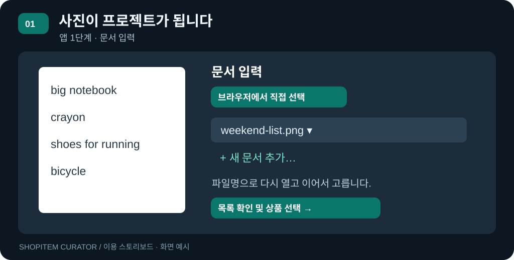
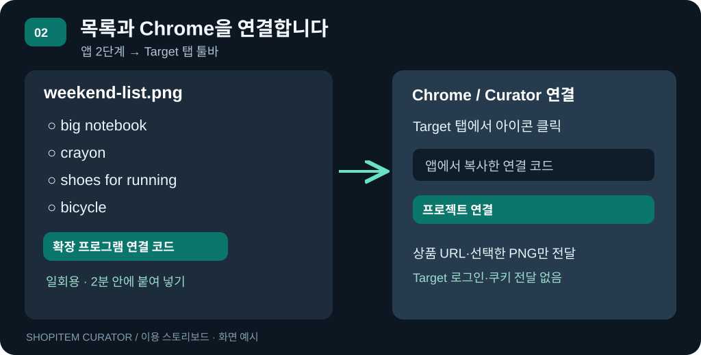
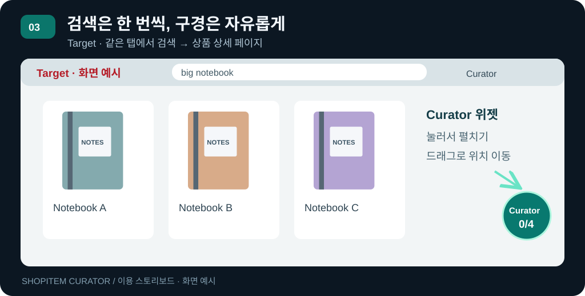
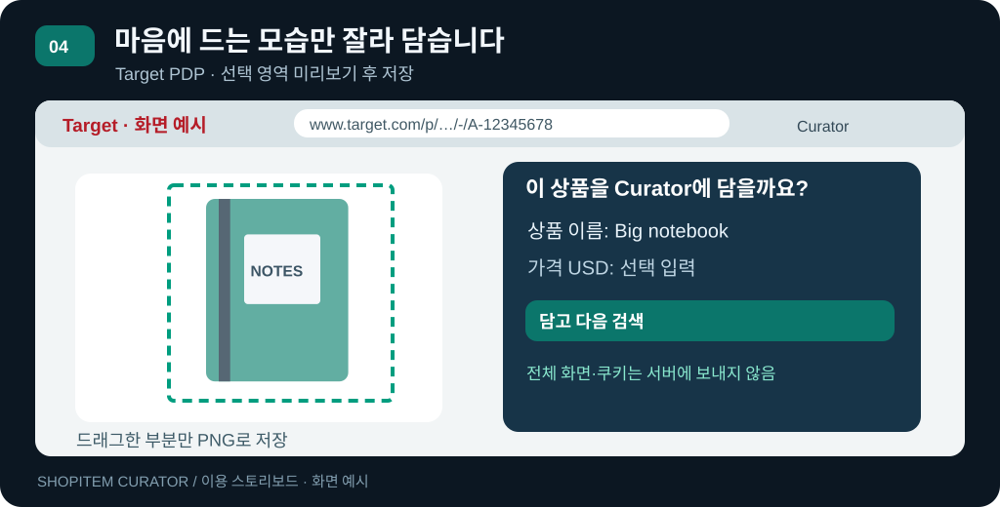
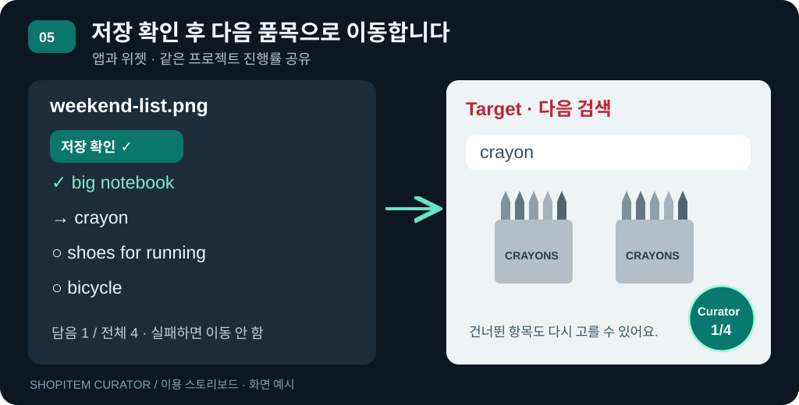
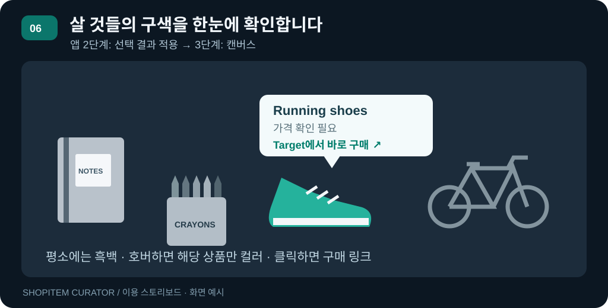
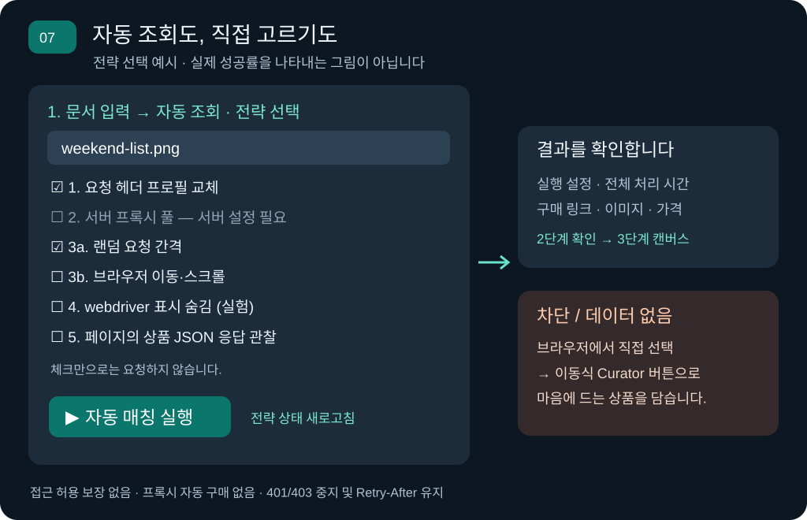

# ShopItem Curator 이용 안내 (`USAGE.md`)

사진 속 쇼핑 목록을 프로젝트로 만들고, 평소처럼 Target을 구경하며 마음에 드는 상품을 담아 하나의 캔버스로 확인합니다.

로컬 앱의 기본은 **브라우저에서 직접 선택** 모드입니다. 자동 조회도 남아 있지만 Target API 접근 제한이 해결된 것은 아닙니다. 확장은 로그인·쿠키를 요구하거나 상품 DOM을 자동 수집하지 않습니다. 일반 Target 검색 페이지, 현재 상품 URL, 직접 잘라 고른 이미지로 동작합니다. Target 자체에서 접근 확인을 요구하면 사이트 안내를 따라야 하며, 이 확장이 차단을 우회하거나 항상 접근을 보장하지는 않습니다.

## 먼저 한 번만 준비하기

1. 아래 로컬 실행 안내에 따라 Dart 백엔드와 Flutter 앱을 시작합니다. 이번 변경은 **백엔드와 앱을 모두 재시작**해야 반영됩니다. 직접 실행한 백엔드는 본인이 종료한 뒤 새 코드로 다시 시작하세요. `tool/run_dev.sh`와 수동 백엔드를 동시에 실행하지 않습니다.
2. 평소 사용하는 **일반 Chrome 창**에서 `chrome://extensions`를 엽니다. **개발자 모드 → 압축해제된 확장 프로그램을 로드합니다**를 누르고 저장소의 [`extension/`](extension/) 폴더를 선택합니다. Chrome 120 이상 대상의 로컬 개발용 확장이며, Chrome 웹 스토어 배포본은 아닙니다.
3. 툴바의 퍼즐 아이콘에서 **ShopItem Curator**를 고정합니다. `https://www.target.com`을 열고, 설치 전에 열었던 Target 탭은 새로고침합니다.
4. **Target 탭에서 툴바의 Curator 아이콘을 한 번 누릅니다.** 이 동작으로 현재 탭의 캡처 권한을 얻습니다. 페이지 위의 이동식 버튼 클릭만으로는 권한이 생기지 않습니다. 새 탭/다른 출처 이동으로 권한이 사라지면 그 탭에서 아이콘을 다시 누르세요. [Chrome activeTab 설명](https://developer.chrome.com/docs/extensions/develop/concepts/activeTab).

확장의 서버 주소는 현재 `http://127.0.0.1:8787`로 고정되어 있습니다. Flutter는 macOS 앱이든 로컬 Chrome Web 앱이든 **같은 백엔드**에 연결해야 합니다. Flutter가 실행한 별도 디버그 Chrome 대신 평소 Chrome에 확장을 설치해도 같은 프로젝트를 사용할 수 있습니다.

## 스토리보드: 사진 한 장에서 쇼핑 캔버스까지

그림은 실제 Target 스크린샷이 아닌 **동작 설명용 SVG 도식**입니다. 버튼 이름과 순서는 구현 기준이며 상품·가격·화면 모양은 예시입니다.

### 컷 1 — 오늘 살 목록을 프로젝트로 만들기



앱 **1. 문서 입력**에서 **브라우저에서 직접 선택**을 고릅니다. 드롭다운의 **새 문서 추가…**로 사진을 추가하거나 기존 파일을 선택합니다. `weekend-list.png`에 `big notebook`, `crayon`, `shoes for running`, `bicycle`이 적혀 있다면, 이 파일명이 프로젝트의 표시 이름이 됩니다.

로컬 OCR이 목록을 만들며, 이때 Target 검색 API는 호출하지 않습니다. 잘못 인식된 경우 더 선명한 사진으로 다시 추가하세요. 현재 앱 내 OCR 항목 직접 편집은 지원하지 않습니다. 같은 이름의 새 업로드에는 접미사가 붙어 기존 프로젝트를 덮어쓰지 않습니다.

### 컷 2 — 앱의 목록과 Chrome을 연결하기



**목록 확인 및 상품 선택 →**를 누릅니다. **2. 상품 선택 및 확인**에서 품목을 확인한 뒤 **확장 프로그램 연결 코드 → 코드 복사**를 누릅니다.

Target 탭의 **툴바 Curator 아이콘**을 누르고 코드를 붙여 넣은 뒤 **프로젝트 연결**을 누릅니다. 코드는 **2분 안에 한 번만** 쓸 수 있고 연결은 해당 프로젝트 하나에 한정됩니다(최대 8시간). 팝업을 닫으면 페이지 위의 Curator 버튼을 사용할 수 있습니다.

### 컷 3 — 한 품목씩 검색하고 구경하기



작은 **Curator 0/4** 원을 누르면 위젯이 펼쳐집니다. 목록에서 `big notebook`을 고르고 **이 품목 Target 검색**을 누릅니다. 현재 탭이 해당 검색 결과로 이동합니다. 검색창을 직접 타이핑하는 대신 일반 검색 URL을 여는 방식입니다.

마음에 드는 상품을 **같은 탭에서** 엽니다. 작은 원이나 펼친 위젯의 제목을 드래그하면 좌우 가장자리로 붙고, 스크롤 중에도 보입니다. **접기**로 작은 원으로 돌아갑니다. 사이드 패널이나 다른 사이트 위에 뜨는 OS 창은 아닙니다.

### 컷 4 — 이미지 부분을 잘라 Curator에 담기



상품 상세 페이지에서 **상품 이미지 선택 → 담기**를 누릅니다. 위젯을 숨긴 뒤 현재 보이는 탭 화면을 캡처하고, 상품 이미지 부분만 드래그하는 화면을 엽니다.

미리보기를 확인하고 **상품 이름**을 수정합니다. **가격 USD**는 선택 입력이며 모르면 비워 둡니다. 가격이 없으면 앱은 **가격 확인 필요**로 표시합니다. **영역 다시 선택**으로 범위를 바꾸거나 Esc/취소로 저장 없이 닫을 수 있습니다.

**담고 다음 검색** 또는 **담기만**을 누를 때만 **잘라낸 PNG + 현재 PDP URL + 직접 입력한 이름·가격**을 저장합니다. 전체 화면은 서버에 보내거나 파일로 저장하지 않습니다. URL은 Target 상품 상세 주소인지 검증하고 추적 쿼리를 제거합니다. 검색 결과 페이지에서는 담을 수 없습니다.

### 컷 5 — 담은 것은 남기고 다음 품목으로



서버가 저장을 확인한 뒤에만 다음 미선택 품목의 검색으로 이동합니다. **건너뛰고 다음 검색**은 품목을 지우지 않고 건너뜀 상태로 남깁니다. 나중에 위젯 목록에서 다시 골라 담을 수 있습니다. 이미 담은 품목도 다시 선택해 교체할 수 있습니다.

앱은 약 6초 간격으로 선택 목록을 확인합니다. 바로 확인하려면 **선택 내용 새로고침**을 누릅니다. 미선택 품목을 임의의 샘플 상품으로 채우지 않습니다.

### 컷 6 — 구색을 한눈에 보고 구매 페이지로



앱 2단계의 **캔버스 시각화 및 인터랙션 →**을 누릅니다. 이 버튼이 최신 선택을 가져오고, 선택한 PNG로 Pure Dart 합성·윤곽선 처리를 완료한 뒤 3단계로 이동합니다. **선택 결과 적용 (N)**을 먼저 누를 필요는 없습니다. 일부만 담아도 사용할 수 있지만, 건너뛰거나 미선택인 품목은 캔버스에 나타나지 않습니다. 담은 상품이 없거나 연결에 실패하면 이유를 표시합니다.

**3. 캔버스 시각화**에서 흑백 구색을 보고, 상품 위에 마우스를 올려 컬러로 살펴봅니다. 클릭하면 가격 말풍선과 Target 구매 링크가 나타납니다. 실제 주문·장바구니 추가·결제는 Target에서 직접 진행합니다.

상품을 선택한 뒤 **오른쪽 아래 ↘ 화살표 핸들**을 바깥쪽으로 당기면 확대, 안쪽으로 당기면 축소됩니다. 가로세로 비율과 왼쪽 위 기준점은 유지하며 캔버스 경계를 넘지 않습니다. 상품 본체 드래그는 위치 이동이고, 키보드 `+`/`−`도 사용할 수 있습니다.

**HTML 다운로드**를 누르면 이미지와 현재 위치·크기가 포함된 `.html` 파일을 내보냅니다. Chrome에서는 브라우저 다운로드 설정에 따라 저장하고, macOS 앱에서는 저장 위치를 고릅니다. 파일명은 `원본문서명-curator.html` 형식이며 코드 복사 창은 표시하지 않습니다. macOS의 사용자 선택 파일 쓰기 권한이 추가되어, 이번 변경은 Hot Reload만 하지 말고 앱을 완전히 종료한 뒤 다시 실행해야 합니다.

다음에 1단계에서 같은 파일명을 선택하면 저장된 품목을 불러와 캔버스를 다시 만듭니다. 담은 결과가 바뀌면 이전 캔버스를 비우고, **캔버스 시각화**를 누를 때 최신 결과로 다시 합성합니다. 크기·위치 조절은 현재 캔버스 세션에 유지되며 HTML 파일에는 반영되지만, 프로젝트에 영구 저장하지는 않습니다.

### 컷 7 — 자동 추출 전략을 골라 비교하기



1. 앱 **1. 문서 입력 → 자동 조회 · 전략 선택**으로 전환하고 파일명을 고릅니다. 이 단계에서는 문서만 준비하며 아직 OCR·Target 자동 매칭을 실행하지 않습니다.
2. **전략 상태 새로고침**으로 백엔드의 준비 상태를 확인합니다. 사용할 수 없는 항목에는 필요한 설정이 표시됩니다.
3. 전략을 하나 또는 여러 개 체크합니다. 아무것도 체크하지 않으면 기존 **기본 HTTP 조회**입니다. 체크만으로 네트워크 요청을 시작하지 않습니다.
4. **자동 매칭 실행**을 누릅니다. OCR → 상품 확인 → 합성 → 윤곽선 순서로 진행하며, 추가 전략을 사용하면 품목별로 순차 요청합니다. 같은 실행 안에서는 설정이 고정됩니다.
5. 실행 후 **2. 상품 선택 및 확인**에서 이미지·구매 링크·가격을 검토합니다. 1단계의 ‘최근 실행’에는 설정, 전체 파이프라인 시간, 구매 링크가 있는 항목 수가 표시됩니다. OCR·이미지 처리·캐시·저장된 후보가 포함되므로 순수 검색 속도나 실시간 매칭 성공률 측정값은 아닙니다.
6. 접근 거부나 미해결 항목이 있으면 **브라우저에서 직접 선택**으로 전환해 컷 2~6을 따릅니다. 자동 결과를 확장 프로젝트에 자동 복사하지는 않습니다. 확장에서 고른 기존 결과는 해당 문서 프로젝트에 따로 남습니다.

선택 설정은 현재 앱 세션에 유지되고 자동 조회·후보 검색·URL 확인·전체 다시 조회에 적용됩니다. 확장 프로그램과 이미지 다운로드 프록시는 별도 경로이며 이 전략들의 영향을 받지 않습니다.

| 선택 전략 | 실제 구현 / 준비 조건 | 한계 |
| --- | --- | --- |
| 1. 요청 헤더 프로필 교체 | 설치된 Chrome 버전을 읽어 macOS/Windows UA·언어·Client Hints HTTP 프로필을 순환. 브라우저 조합은 UA override와 해당 Client Hints를 적용 | TLS·GPU·폰트 등 전체 브라우저 지문 복제 아님. Safari를 가장하지 않음 |
| 2. 서버 프록시 풀 | 운영자 등록 HTTP CONNECT 프록시를 요청 단위로 순환. 브라우저에도 같은 풀 적용 | 프록시 자동 수집·구매 없음. 주거용 여부/비용은 제공자 계약에 달림. 실패 시 직접 연결로 전환하지 않음 |
| 3a. 랜덤 요청 간격 | 전략 요청 시작을 직렬로 조절하고 1.2~3.8초 지연 | 탐지 우회 보장 아님. 품목이 많으면 느림 |
| 3b. 브라우저 이동·스크롤 | 별도 임시 Chromium에서 제한된 마우스 이동·스크롤 후 DOM 읽기 | 클릭·장바구니·결제 조작 없음. 읽기 전용 GET과 제한된 호스트만 허용 |
| 4. webdriver 표시 숨김 (실험) | 임시 컨텍스트의 `navigator.webdriver` getter를 숨김 | `undetected-chromedriver`/stealth 패키지는 설치하지 않음. 다른 자동화 식별 신호는 남음 |
| 5. 페이지의 상품 JSON 응답 관찰 | 페이지가 받은 허용 호스트의 GET XHR/Fetch JSON에서 이름·가격·PDP·이미지 DTO만 추출 | 임의 엔드포인트 직접 호출, 로그인 쿠키·API 키 복사, HAR 저장 없음. 인증·차단을 건너뛰는 방식 아님 |

#### 자동 전략을 위한 서버 준비

기본 HTTP와 랜덤 간격에는 브라우저 의존성이 필요 없습니다. 헤더 프로필은 Node와 Chrome 버전 확인이 필요하고, 3b·4·5에는 추가로 Playwright 어댑터가 필요합니다. 아래 명령은 브라우저 자체를 다운로드하거나 유료 서비스를 만들지 않습니다.

```bash
cd server/browser
npm ci --ignore-scripts --no-audit --no-fund
cd ../..
```

Node 22 이상과 설치된 Chrome/Chromium을 사용합니다. 서버 실행 환경에 따라 다음 변수를 지정합니다. macOS Chrome 경로는 기본값이며, Node가 IDE에서 보이지 않으면 `command -v node`의 절대 경로를 `CURATOR_BROWSER_NODE`에 설정하세요.

```bash
export CURATOR_BROWSER_EXECUTABLE="/Applications/Google Chrome.app/Contents/MacOS/Google Chrome"
# export CURATOR_BROWSER_NODE="/absolute/path/to/node"
```

서버는 `.env`를 자동으로 읽지 않습니다. 환경변수를 설정한 터미널에서 실행하거나 IDE 백엔드 실행 환경에 전달한 뒤 **백엔드와 앱을 재시작**합니다. 사용자가 이미 띄운 백엔드를 러너와 동시에 띄우지 않습니다. 서버는 사용자 Chrome 프로필에 붙지 않고 별도 임시 브라우저를 한 번에 하나만 실행합니다. 브라우저 의존성이 없으면 해당 선택만 비활성화되고 기본/확장 모드는 그대로 사용 가능합니다.

프록시 풀은 선택 사항입니다. **현재 기본은 빈 풀(비용 0원)**이며 다음은 형식 예시일 뿐 실제 주소가 아닙니다. 자신에게 사용 권한이 있는 제공자의 HTTP CONNECT 주소로만 설정하세요(최대 16개). HTTPS 대상 연결의 인증서 검증을 끄지 않습니다.

```bash
export CURATOR_MATCHING_PROXY_POOL='[{"url":"http://proxy.example.invalid:8080","username":"YOUR_USER","password":"YOUR_PASSWORD"}]'
```

주소·계정·비밀번호는 서버에만 두며 Git, 채팅, Flutter `--dart-define`에 넣지 않습니다. 개발 실행 스크립트는 이 변수를 Flutter 자식 프로세스에서 제거합니다. 브라우저 자식 프로세스에는 필요한 프록시 설정만 표준 입력으로 전달하며 앱의 인증 토큰이나 OCR 환경 전체를 전달하지 않습니다.

#### 확장 프로그램과 자동 추출의 편의성 비교

| 방식 | 사람이 하는 일 | 유리한 점 | 남는 제약 |
| --- | --- | --- | --- |
| 이동식 확장 버튼 | 검색 결과 구경 → 상품 선택 → 이미지 영역 지정 → 담기 | 취향·모양을 직접 고름. 서버 검색 API 없이 평소 쇼핑 흐름 활용 | 품목별 선택과 이미지 지정 필요. 가격은 직접 입력 |
| 기본/헤더/프록시 HTTP | 문서 선택 → 설정 → 실행 → 결과 확인 | 렌더링 비용이 작고 자동으로 초안 구성 | HTML/데이터 API 접근 제한, 가격·상품 데이터 누락 가능 |
| 임시 브라우저 + JSON 관찰 | 문서 선택 → 설정 → 실행 → 결과 확인 | JS 렌더링 후 상품 데이터가 실제로 제공되면 자동 메타데이터 수집 | 더 느리고 메모리 사용 큼. 허용 호스트/GET 제한 때문에 일부 페이지 기능은 동작하지 않을 수 있음 |

SEO 페이지 공개와 상품 API 접근 허용은 별개입니다. 사이트가 일반 검색엔진에 페이지를 제공한다고 해서 이 앱의 검색·JSON 요청까지 허용하는 것은 아닙니다. 403은 요청을 이해했지만 수행을 거부하는 응답입니다. 이 구현은 모든 전략에 걸쳐 **401/403 이후 해당 호스트 요청을 중지**, **429의 Retry-After 유지**, **CAPTCHA 자동 처리 없음**을 적용합니다. 설정을 바꾸거나 다른 IP를 골라 이 중지를 자동 해제하지 않습니다. [HTTP 403 정의](https://www.rfc-editor.org/rfc/rfc9110.html#name-403-forbidden).

검증은 요청 모의 응답과 격리된 실제 Chrome 테스트 페이지로 수행합니다. 실제 Target, 유료/주거용 프록시, Render/Vercel 환경에서 접근 성공을 보장하지 않습니다. 배포 재개 요청에 따른 현재 상태는 [배포 계획](deploy.md)을 확인하세요. 구현에 사용한 브라우저 기능은 [Playwright 네트워크 관찰](https://playwright.dev/docs/network), [브라우저 컨텍스트 초기 스크립트](https://playwright.dev/docs/api/class-browsercontext#browser-context-add-init-script)를 참고하세요.

#### 개발자 검증 명령

```bash
flutter analyze
CURATOR_TEST_AVIF=1 flutter test --concurrency=1 --reporter expanded
CURATOR_TEST_BROWSER=1 node --test server/browser/runner.test.cjs
node --test extension/test/worker.test.cjs
node extension/test/content_smoke.cjs
```

브라우저 테스트는 일반 사용자 Chrome과 분리된 임시 프로필을 사용하며 상품 사이트 요청은 테스트 응답으로 대체합니다. `CURATOR_TEST_BROWSER`를 지정하지 않으면 실제 Chromium 실행 테스트 두 개만 생략합니다. 위 검증에서 Dart/Flutter 298개 통과(선택 테스트 3개 제외), 브라우저 전략 7개 및 확장 worker 6개 통과, 7컷 SVG 표시 확인, Web 릴리스 빌드와 서버 AOT 컴파일까지 확인했습니다. 이는 실제 상품 조회 성공률 검증과 구분됩니다.

## 연결·저장에 대해 알아둘 점

| 상황 | 이용 방법 / 동작 |
| --- | --- |
| 버튼이 안 보임 | 확장을 켜고 Target 탭을 새로고침합니다. 다른 사이트에는 표시하지 않습니다. |
| 캡처 권한 오류 / 새 상품 탭 | 해당 탭의 **툴바 Curator 아이콘 → 이 탭 사용 / 캡처 준비**를 누르고 팝업을 닫습니다. |
| 다른 프로젝트로 바꾸기 | 앱에서 파일명을 선택하고 새 코드를 확장에 입력합니다. 이전 탭의 결과를 새 프로젝트에 섞지 않습니다. |
| 백엔드/Chrome 재시작, 8시간 경과 | 선택은 저장소에 남지만 연결 권한은 다시 발급받아야 합니다. |
| 연결 코드 재사용 / 2분 경과 | 앱에서 새 코드를 만듭니다. 같은 프로젝트를 새로 연결하면 이전 연결 권한은 폐기됩니다. |
| 선택 내용 변경 오류 | 목록을 새로고침하고 해당 상품을 다시 캡처합니다. 오래된 선택으로 덮어쓰지 않습니다. |
| 저장 실패 | 다음 품목으로 넘어가지 않습니다. 연결 복구 후 같은 저장 버튼으로 재시도합니다. 캡처는 5분 후 다시 해야 합니다. |
| 큰 이미지 | 더 작은 영역을 선택합니다. 클라이언트는 긴 변 최대 1,000px, 서버는 단일 PNG 최대 1,200×1,200px·2 MiB로 제한합니다. |
| 윤곽선 품질 | 캡처 해상도·배경에 영향을 받습니다. 상품을 크게 표시하고 단색 배경만 좁게 선택하세요. AVIF 원본을 내려받지 않으므로 담기에 AVIF 디코더는 필요하지 않습니다. |
| 가격·재고 | 자동 수집하지 않습니다. 입력한 가격은 구매 페이지에서 최종 확인하세요. |

저장 위치는 `<CURATOR_ASSETS_DIR>/.curator_projects/<프로젝트 ID>/`이며 목록 JSON과 선택 PNG를 보관합니다. 원본 문서를 삭제하면 프로젝트·캡처도 같은 저장소의 `deleted-<ID>-<임의 값>/`으로 보관 이동되고 기존 확장 권한은 즉시 폐기됩니다. 원본 문서와 기존 샘플 에셋은 아래 설명처럼 `.document_trash/`로 이동합니다. 복구 UI·자동 영구 삭제는 없으며, 서버를 중지한 뒤 원본과 프로젝트를 함께 수동 복구할 수 있습니다. 두 저장소 모두 Git·Flutter 번들에서 제외합니다. 백업 시 원본과 `.curator_projects/`를 함께 보관하세요. 활성 프로젝트 최대 100개, 프로젝트당 OCR 목록 최대 50개입니다.

연결 권한은 페이지 DOM이나 content script에 전달하지 않고 확장의 `storage.session`에만 둡니다. Target 페이지 표시·로컬 서버 통신과 `activeTab`, `storage`만 사용하며 `cookies`, `webRequest`, `<all_urls>`, 사이드 패널 권한은 요청하지 않습니다. [Chrome content scripts](https://developer.chrome.com/docs/extensions/develop/concepts/content-scripts), [탭 캡처 API](https://developer.chrome.com/docs/extensions/reference/api/tabs#method-captureVisibleTab).

**로컬 또는 개인용 Render 체험에 연결할 수 있습니다.** 내부 브리지는 계속 loopback 전용입니다. Render에서는 앱 세션 인증과 프로젝트 권한을 분리해 검증하는 전용 게이트웨이를 사용합니다. 임의 reverse proxy로 브리지 제한을 해제하지 마세요. [현재 배포 상태](deploy.md)를 참고하세요.

### Render에서 이용하기

1. 최신 `extension/`을 내려받고 `chrome://extensions`에서 Curator의 **새로고침**을 누릅니다. Target 탭도 새로고침합니다.
2. [Render 앱](https://shopitem-curator.onrender.com)을 먼저 열어 서버가 깨어나기를 기다립니다. [서비스 Dashboard](https://dashboard.render.com/web/srv-dafpag5g1s2s73fi2arg)의 **Environment → CURATOR_PREVIEW_PASSWORD** 값을 확인해 로그인합니다. 이 비밀번호는 확장 팝업에 넣지 않습니다.
3. 앱 1단계에서 사진을 선택하고 2단계에서 **확장 프로그램 연결 코드**를 누릅니다.
4. Target 탭의 확장 팝업에서 **Curator 서버 주소**에 `https://shopitem-curator.onrender.com`을 입력합니다. 로컬로 돌아가려면 `http://127.0.0.1:8787`을 입력합니다.
5. 일회용 코드를 입력하고 **프로젝트 연결**을 누릅니다. Chrome이 묻는 **해당 Render 서버의 연결 권한**을 허용합니다. 모든 사이트 권한이나 Target 쿠키 권한은 필요하지 않습니다. [Chrome 선택적 호스트 권한](https://developer.chrome.com/docs/extensions/develop/concepts/declare-permissions)
6. 기존 스토리보드처럼 품목 검색 → 이미지 영역 선택 → 담기를 반복하고, 앱에서 **캔버스 시각화 및 인터랙션**을 누릅니다.
7. 필요한 결과는 **HTML 다운로드**로 보관합니다. 무료 서버가 쉬거나 재시작·재배포되면 문서·캡처·연결이 사라질 수 있습니다. HTML은 프로젝트 복원용 백업이 아니므로 원본 사진도 보관하세요.
8. 앱 상단 로그아웃을 누르고 확인합니다. 확장 권한은 별도이므로 확장 팝업에서도 **연결 해제**를 누릅니다.

재시작 또는 세션 만료 후에는 앱을 새로고침해 다시 로그인하고 새 코드를 발급받습니다. 비밀번호 공유 시 문서 열람·삭제 권한도 공유됩니다. 무료 컨테이너에는 서버용 브라우저 자동화 전략이 포함되지 않지만 사용자 Chrome의 직접 선택 기능은 사용할 수 있습니다.

---

## 📋 1. 사전 요구사항 (Prerequisites)

* **Flutter SDK**: 3.22.0 이상 (권장 3.44.x+)
* **Dart SDK**: 3.4.0 이상 (권장 3.12.x+)
* **서버 OCR**: Tesseract와 영어 언어 데이터 (`brew install tesseract`; Debian/Ubuntu는 `tesseract-ocr tesseract-ocr-eng`)
* **Target AVIF 디코더**: 서버에 `libavif`의 `avifdec` 설치 (`brew install libavif`; Debian 13은 `libavif-bin`)
* **구성된 플랫폼**: Web (Chrome, Safari 등), macOS 데스크톱
* `.metadata`, `web/`, `macos/` 스캐폴딩과 VS Code Chrome/macOS 실행 구성이 저장소에 포함되어 있습니다.

---

## 🚀 2. 로컬 실행 및 개발 (Local Development)

### 2.1 패키지 설치

```bash
cd /Users/mac/Antigravity/shopitem-curator
flutter pub get
```

### 2.2 Pure Dart Core 비즈니스 로직 독립 테스트

```bash
# Pure Dart 단위 테스트 실행 (Flutter 엔진 없이 순수 Dart VM으로 구동)
dart test test/core_bloc_test.dart
```

### 2.3 전체 정적 분석 및 회귀 테스트

```bash
flutter analyze
flutter test --concurrency=1
node --test extension/test/worker.test.cjs
# macOS에 설치된 별도 headless Chrome으로 위젯 DOM 조작 검증 (연결부는 모의 처리)
node extension/test/content_smoke.cjs
```

> `dart test`만 실행하면 `widget_test.dart`가 필요로 하는 Flutter 엔진(`dart:ui`)을 로드할 수 없습니다. 전체 테스트 스위트는 반드시 `flutter test`로 실행하세요.

### 2.4 애플리케이션 실행

Flutter 앱은 외부 OCR API나 Target에 직접 요청하지 않습니다. OCR은 서버에서 로컬 실행됩니다. 로컬에서도 먼저 Dart 프록시를 실행한 뒤 앱을 실행합니다.

**터미널 1 — 백엔드 프록시**

```bash
# macOS 최초 설치 (Google 계정 / API 키 불필요)
brew install tesseract libavif
tesseract --list-langs
avifdec --version

# Chrome 개발 서버의 정확한 origin만 허용
export CURATOR_CORS_ALLOW_ORIGIN='http://localhost:3000'
dart run server/curator_proxy_server.dart
```

`.env.example`은 설정 템플릿일 뿐입니다. 서버는 `.env`를 자동으로 읽지 않고 시작된 **프로세스 환경**의 값만 읽습니다.

#### Target AVIF 이미지 지원

Target은 URL에 `fmt=pjpeg`가 있어도 AVIF를 반환할 수 있습니다. 이미지 프록시는 MIME 및 실제 파일의 AVIF 브랜드를 확인한 뒤 서버의 `avifdec`로 PNG로 변환합니다. 투명도를 보존하므로 기존 `package:image` 합성과 정밀 윤곽선 추출을 macOS/Web에서 그대로 사용합니다. Pure Dart 코어에 Flutter 또는 FFI 의존성을 추가하지 않습니다.

- 서버에 `brew install libavif`를 실행합니다. Linux는 `libavif-bin`을 런타임에 설치합니다(Debian 13의 1.2.1 이상 기준). `avifdec --help`에 `--size-limit`, `--dimension-limit`가 모두 있어야 합니다.
- 기본 실행 파일은 `avifdec`입니다. IDE PATH 문제가 있으면 **서버 프로세스**에 `CURATOR_AVIFDEC_BIN=/usr/local/bin/avifdec`(Intel Mac), `/opt/homebrew/bin/avifdec`(Apple Silicon), `/usr/bin/avifdec`(Linux)를 지정합니다.
- 변환은 첫 프레임·8-bit PNG, 최대 1,600만 화소·한 변 8,192px, 입력 최대 8 MiB, 출력 `CURATOR_MAX_IMAGE_BYTES` 이하로 제한됩니다. 동시에 2개 작업(각 2스레드), 최대 대기 32개이며 대기 포함 최대 10초입니다.
- 디코더가 없으면 이미지 endpoint는 `503/avif_decoder_unavailable`, 잘못된 AVIF는 `502/avif_decode_failed`를 반환합니다. 기존 `/ready`는 OCR 준비 상태 확인이며 AVIF 설치 검증을 대신하지 않습니다.
- 기존 JPEG/PNG/WebP/GIF는 그대로 전달됩니다. 새 상품 URL의 `raster=png-v1`은 이전 AVIF HTTP 캐시와 구분하기 위한 고정 버전입니다. 백엔드와 Flutter 앱을 함께 재시작한 뒤 문서를 다시 실행해야 이미 계산된 fallback 윤곽선도 재생성됩니다.

실제 디코더와 투명 AVIF → 인증 프록시 → Pure Dart 윤곽선 경로 검증:

```bash
CURATOR_TEST_AVIF=1 dart test test/avif_image_decoder_test.dart test/target_avif_pipeline_test.dart
# 외부 Target 이미지 3개까지 검증할 때만 네트워크 테스트 활성화
CURATOR_TEST_AVIF=1 CURATOR_TEST_TARGET_AVIF=1 dart test test/target_avif_pipeline_test.dart
```

기본 테스트는 외부 Target과 설치된 네이티브 디코더에 의존하지 않도록 해당 통합 테스트를 생략합니다. [libavif CLI](https://github.com/AOMediaCodec/libavif/blob/main/doc/avifdec.1.md), [Debian 패키지](https://packages.debian.org/trixie/libavif-bin).

**터미널 2 — Flutter Web**

```bash
flutter run -d chrome --web-port=3000
```

localhost/127.0.0.1/IPv6 loopback에서 실행되는 Web과 macOS에서는 미지정 백엔드 주소가 `http://127.0.0.1:8787`이므로 별도 define 없이 실행할 수 있습니다. 다른 개발 API를 사용할 때만 `--dart-define=CURATOR_BACKEND_URL=...`을 지정합니다.

```bash
flutter run -d macos
```

`flutter run -d macos`는 앱만 시작하고 프록시를 자동 실행하지 않습니다. 위의 터미널 1 프록시를 계속 실행한 상태에서 사용하세요.

한 터미널에서 프록시 준비 확인 후 앱까지 실행하려면 공통 개발 실행기를 사용할 수 있습니다.

```bash
bash tool/run_dev.sh --device chrome
bash tool/run_dev.sh --device macos
```

실행기는 자신이 시작한 프록시의 `/health` 서비스 ID와 `/ready`에서 OCR 실행 파일·언어 데이터 준비 여부를 검증한 뒤 앱을 실행합니다. 기존 프록시는 인증·CORS 계약을 안전하게 확인할 수 없으므로 재사용하지 않으며, 포트가 사용 중이면 중단합니다. 서버 인증 환경변수는 Flutter에 전달하지 않습니다. 실행기가 시작한 프록시가 종료되면 Flutter도 정리합니다.

기존 `bash tool/run_macos_dev.sh`는 macOS용 호환 wrapper입니다. 앱을 띄우지 않고 프록시와 OCR 엔진 준비만 확인하려면 `bash tool/run_dev.sh --check`를 사용합니다. 이 확인은 `/health`와 `/ready`만 호출하며 이미지 추출이나 Target 조회를 실행하지 않습니다. 실제 OCR 검증은 `dart run tool/check_local_ocr.dart`를 사용하세요.

VS Code/Antigravity에서는 `Curator: Proxy + Chrome` 또는 `Curator: Proxy + macOS`로 함께 시작합니다. 프록시 wrapper는 새 login shell의 Dart/Tesseract PATH를 사용하며 API 키 누락 검사는 없습니다. PATH에서 엔진을 찾지 못하면 `CURATOR_TESSERACT_BIN=/usr/local/bin/tesseract`(Intel Mac) 또는 `/opt/homebrew/bin/tesseract`(Apple Silicon)를 서버 환경에 지정하세요. 기존 8787 listener가 있으면 수동 백엔드를 종료한 뒤 복합 실행을 시작합니다.

앱이 프록시보다 먼저 시작되면 `/ready` GET만 200ms에서 최대 2초까지 backoff하며 계속 확인하고, 화면에는 자동 복구 대기 상태가 표시됩니다. 응답이 멈춘 readiness GET은 `AbortableRequest`로 취소되고 종료된 뒤에만 다음 GET을 시작하므로 요청이 겹쳐 쌓이지 않습니다. 프록시의 OCR 엔진이 준비되면 초기 이미지를 한 번만 제출합니다. OCR·Target POST는 자동으로 재시도하지 않습니다. 호환되지 않는 readiness 응답 등으로 초기화가 중단된 경우 `백엔드 다시 확인`은 `/ready`부터 다시 검증하며 이미지 bytes를 직접 전송하지 않습니다. `Terminal → Run Task`의 ready task는 같은 login-shell 정책을 사용하는 비디버그 대안입니다.

`CURATOR_BACKEND_URL`만 공개 클라이언트 설정이며, 경로 prefix가 있는 `https://example.com/curator-api/`도 지원합니다.

### 2.5 VS Code Flutter 확장 복구

이 저장소에는 Dart/Flutter 확장 권장 목록과 SDK 경로, Chrome/macOS 실행 구성이 `.vscode/`에 포함되어 있습니다. VS Code에서 디버깅, 자동 완성, 장치 목록이 보이지 않으면 다음 순서로 확인합니다.

1. `lib/`가 아닌 `/Users/mac/Antigravity/shopitem-curator` 폴더 전체를 VS Code에서 엽니다.
2. Extensions 패널에서 `Dart`(`dart-code.dart-code`)와 `Flutter`(`dart-code.flutter`)가 이 워크스페이스에서 Enabled 상태인지 확인합니다.
3. Command Palette의 `Flutter: Change SDK`에서 `/usr/local/share/flutter`를 선택합니다. 같은 값이 `.vscode/settings.json`에도 고정되어 있습니다.
4. `Developer: Reload Window`를 실행한 뒤 `Dart: Restart Analysis Server`를 실행합니다.
5. VS Code 터미널에서 `/usr/local/share/flutter/bin/flutter doctor -v`와 `/usr/local/share/flutter/bin/flutter devices`를 실행해 SDK와 Chrome/macOS 장치를 확인합니다.
6. 계속 작동하지 않으면 View → Output의 `Dart` 및 `Flutter` 채널에서 첫 오류를 확인한 뒤 VS Code를 완전히 종료하고 다시 엽니다.

`code` 명령이 쉘 PATH에 없는 것은 VS Code 내부의 Dart/Flutter 확장 활성화와는 별개입니다. 필요하면 VS Code의 `Shell Command: Install 'code' command in PATH`를 실행하세요.

---

## 🎯 3. 주요 기능 및 4단계 파이프라인 사용법

### 1) 1번 화면의 문서 선택·추가·삭제

- 드롭다운은 백엔드 `assets/images/`의 실제 JPEG/PNG 목록을 표시합니다. 두 예제 이름이 더 이상 고정 목록으로 사용되지 않습니다.
- **새 문서 추가…**를 선택하면 macOS/브라우저의 파일 선택창이 열립니다. JPEG/PNG, 최대 8 MiB·1,600만 화소를 지원하며 PDF는 아직 지원하지 않습니다.
- 추가한 파일은 백엔드에 복사되어 앱/백엔드를 다시 실행해도 남습니다. 이름이 같으면 접미사를 붙이며 기존 파일은 덮어쓰지 않습니다. 파일 선택 전의 원본은 수정하거나 삭제하지 않습니다.
- 각 문서 행의 **휴지통 버튼 → 삭제 확인**으로 입력 원본, 그 문서를 `source_image`로 참조하는 매니페스트, 그 매니페스트에서만 사용하는 캔버스·상품 에셋을 활성 저장소에서 제거합니다. 다른 매니페스트에서도 참조하는 공유 에셋과 소유 관계가 확인되지 않는 파일은 보존합니다.
- 삭제 파일은 `<CURATOR_ASSETS_DIR>/.document_trash/<삭제 ID>/{images,items}/`로 이동합니다. 복구 UI는 없으며 서버를 중단한 상태에서 해당 파일을 같은 상대 경로로 되돌린 뒤 목록을 새로고침합니다. 같은 이름의 파일이 있으면 덮어쓰지 말고 먼저 충돌을 해결하세요. 휴지통 자동 영구 삭제는 하지 않습니다.
- 선택한 문서를 삭제하면 미리보기·분석 결과를 비우고 1번 화면에 남습니다. 마지막 문서도 삭제할 수 있고, 이후 새 문서를 추가할 수 있습니다. OCR 실패 시에도 메뉴와 **문서 분석 다시 시도**가 표시됩니다.
- **새로고침**은 다른 클라이언트나 서버 파일 작업으로 변경된 목록을 다시 읽습니다.

기본 저장소는 프로젝트 루트에서 실행한 서버의 `./assets`입니다. 다른 저장소는 서버 환경변수 `CURATOR_ASSETS_DIR`로 지정합니다. 별도 저장소는 빈 목록으로 시작하며 예제를 자동 복사하지 않습니다. 프록시 한 프로세스가 한 저장소를 관리하는 공유 카탈로그이며, 사용자별 분리는 아직 없습니다. 운영에서는 인증과 문서 관리 권한, 영구 저장소, 휴지통 보존/백업 정책을 먼저 구성하세요.

이번 기능은 백엔드 라우트와 네이티브 플러그인이 추가되었으므로 **백엔드와 Flutter 앱을 모두 종료 후 재실행**해야 합니다. hot reload만으로 적용되지 않습니다. macOS 파일 선택에는 Flutter 공식 [`file_selector`](https://pub.dev/packages/file_selector)의 사용자 선택 파일 읽기 전용 권한을 사용합니다.

### 2) 4단계 자동 큐레이션 파이프라인 동작

1단계에서 **자동 조회 · 전략 선택 → 자동 매칭 실행**을 누르면 다음 4단계를 순차 실행합니다. 기본 브라우저 모드는 위 스토리보드처럼 목록 추출 후 사용자 선택을 기다립니다:

1. **1단계 (`BackendProxyGateway` → `OcrExtractorService`)**: 백엔드의 로컬 Tesseract로 글자·좌표 인식 후 Pure Dart에서 물품명·수량·개인용 표시 및 표 설명 해석
2. **2단계 (`BackendProxyGateway` → `TargetFetcherService`)**: 백엔드에서 Target 상품 이미지·가격·구매 URL 검색
3. **3단계 (`CanvasCompositorService`)**: 수집된 물품들을 단일 캔버스 레이어로 자동 합성
4. **4단계 (`ContourSegmenterService`)**: 각 물품의 1:1 정밀 윤곽선(Polygon Silhouette)을 도려내어 세그멘테이션 완료

앱 실행 중의 최종 캔버스는 BLoC 메모리에 유지됩니다. 브라우저 모드의 목록·선택 PNG·URL은 서버에 저장하고 재선택 시 캔버스를 다시 만듭니다. 최종 매니페스트·합성 PNG까지 자동 저장하지는 않습니다. Flutter 번들 `assets/`는 읽기 전용이며 문서 관리는 백엔드 파일과 인증 API를 사용합니다. 기존 자동 모드의 매니페스트·합성 PNG를 파일로 만들려면 아래 개발 도구를 실행합니다.

```bash
# 기본 예제 이미지 2개의 manifest_*.json과 canvas_*.png 재생성
dart run tool/generate_curator_assets.dart

# 특정 입력만 재생성
dart run tool/generate_curator_assets.dart assets/images/new.jpg

# 가능한 경우 실시간 Target 카탈로그 탐색을 우선
dart run tool/generate_curator_assets.dart --live

# 공식 Target PDP의 현재 메인 이미지로 로컬 item_*.jpg/png도 교체 후 재생성
dart run tool/generate_curator_assets.dart --refresh-images

# 네트워크/OCR 없이 현재 로컬 이미지로 합성 PNG와 윤곽선만 재생성
dart run tool/generate_curator_assets.dart --rebuild-only
```

생성물은 `assets/items/`에 씁니다. 개인 문서가 공개 저장소나 Flutter 번들에 섞이지 않도록 새 파일은 기본적으로 Git·번들에서 제외됩니다. 공개 가능한 샘플만 검토 후 `.gitignore`와 `pubspec.yaml`의 명시적 목록에 추가하고 앱을 다시 빌드하세요. 일반 사용자 업로드는 인증된 백엔드 문서 API에서 읽으므로 번들 등록이 필요 없습니다.

Target 자동 검색에는 외부 접근 제한이 있습니다. 서버용 API 접근 승인이 없는 기본 설정에서는 RedSky를 호출하지 않으며, 공개 HTML에 상품 데이터가 없으면 미해결 이유를 표시합니다. 저장된 카탈로그 결과의 가격·재고는 실시간 검증값이 아닙니다. 권한이 있는 운영자만 서버에 `CURATOR_TARGET_REDSKY_KEY`를 설정하세요. 401/403은 같은 프로세스에서 반복하지 않습니다. [상세 검토 결과](docs/target-search-review.md)를 참고하세요.

현재 매니페스트와 상품 이미지로 복사 가능한 self-contained HTML도 만들 수 있습니다. 기본 입력은 전체 25종 매니페스트이며, 이전 Python 명령은 같은 Dart 구현을 호출하는 호환 래퍼입니다.

```bash
dart run tool/export_curator_html.dart

# 입력 매니페스트와 출력 파일을 직접 지정
dart run tool/export_curator_html.dart \
  assets/items/manifest_new.json \
  build/curator_new.html

# 기존 명령 호환
python3 generate_standalone_map.py
```

### 3) 흑백 ➔ 컬러 전환 및 말풍선 가격 태그

* **기본 상태**: 차분한 흑백(Grayscale) 상태로 단일 레이어에 렌더링
* **마우스 호버 / 터치**: 마우스 커서를 올리거나 터치하면 **해당 물품의 1:1 윤곽선만 선명한 풀컬러(Color)**로 전환
* **클릭 시 말풍선 가격 태그**: 물품을 클릭하면 상단에 **꼬리표 말풍선 가격 태그**가 등장하며, **[Target에서 바로 구매하기 ↗]** 링크를 클릭하면 브라우저로 공식 Target 페이지가 열립니다.

구매 버튼은 HTTPS `target.com` 상품 상세(PDP) URL만 활성화합니다. 검색 결과(`/s/...`), 이미지 CDN, 타 도메인, 검증되지 않은 URL은 직링크로 표시하지 않으며 새 PDP가 확인될 때까지 비활성화됩니다.

---

## 🌐 4. 플랫폼별 빌드 및 배포 (Build & Deployment)

### 4.1 빌드

```bash
# 권장: 웹 앱과 /v1 프록시가 같은 origin인 배포
flutter build web --release

# 별도 API origin을 쓰는 배포
flutter build web --release \
  --dart-define=CURATOR_BACKEND_URL=https://api.example.com/curator/

# macOS 데스크톱 앱 릴리즈 빌드
flutter build macos --release
```

Web에서 `CURATOR_BACKEND_URL`을 지정하지 않으면 loopback origin은 로컬 `http://127.0.0.1:8787`, 그 밖의 운영 origin은 현재 Web origin의 root를 사용합니다. 운영에서는 이 같은 same-origin 구성이 CORS와 인증 운영을 가장 단순하게 만듭니다. macOS 앱에는 프록시 통신을 위한 App Sandbox의 `com.apple.security.network.client` entitlement가 Debug/Profile과 Release 구성 모두에 포함되어 있습니다.

### 4.2 운영 토폴로지와 인증

```text
Flutter Web ── HTTPS/사용자 인증 ──> 우리 Reverse Proxy
                                       └──> Dart Curator Proxy
                                               ├──> 로컬 Tesseract (외부 통신 없음)
                                               └──> Target/Scene7
```

`Flutter Web → 우리 백엔드 → 외부 API`라는 말은 브라우저가 외부 서비스의 키나 스크래핑 세부사항을 알지 못하고, 우리가 운영하는 서버의 버전화된 `/v1/*` API만 호출한다는 뜻입니다. 서버는 Target/Scene7 host 허용 목록, 요청·이미지 크기, timeout, IP별 rate limit을 강제합니다.

운영 권장 구성은 다음과 같습니다.

1. Dart 서버를 `CURATOR_PROXY_HOST=127.0.0.1`로 외부에 직접 노출하지 않습니다.
2. TLS·세션/OIDC 인증을 담당하는 reverse proxy에서 브라우저의 `/v1/*` 요청을 인증합니다.
3. reverse proxy가 클라이언트의 `X-Curator-Authenticated` 헤더를 반드시 제거한 뒤, 인증 성공 요청에만 `X-Curator-Authenticated: 1`을 주입합니다.
4. Dart 서버에 `CURATOR_TRUSTED_AUTH_HEADER=X-Curator-Authenticated`를 설정합니다. 이 모드는 loopback bind에서만 허용됩니다.
5. `CURATOR_CORS_ALLOW_ORIGIN` 는 실제 Web origin만 쉼표로 구분해 지정합니다. 예: `https://curator.example.com,https://admin.example.com`.

`CURATOR_PROXY_TOKEN`은 서버-서버 또는 OS 안전 저장소를 사용하는 통제된 네이티브 호출을 위한 대안 인증입니다. **공개 Flutter Web의 소스, `--dart-define`, JavaScript 번들에 이 토큰을 넣지 마세요.** Web은 same-origin reverse proxy의 사용자 세션과 내부 헤더/토큰 주입을 사용해야 합니다.

### 4.3 서버 환경변수

OCR은 Google API를 사용하지 않으며 키가 필요 없습니다. `CURATOR_TESSERACT_BIN`(기본 `tesseract`)과 `CURATOR_OCR_LANGUAGE`(기본 `eng`)를 선택적으로 지정합니다. 엔진 또는 언어 데이터가 없으면 `/ready`와 OCR endpoint가 `503`을 반환합니다. 설치 후 readiness는 자동 회복하며 환경변수 변경은 백엔드 재시작이 필요합니다. 한글은 `kor` 언어 데이터를 별도 설치하고 `CURATOR_OCR_LANGUAGE=eng+kor`로 지정하세요. `.env` 자동 로드는 없습니다.

입력은 단일 프레임 JPEG/PNG, 8 MiB 및 1,600만 화소 이하입니다. 임시 입력 파일은 요청 완료/실패 시 삭제하고 외부 OCR 서버로 전송하지 않습니다. 프로세스당 OCR 동시 실행은 2개이며 초과 요청은 `429`입니다. OCR 시간 초과 시 자식 프로세스를 종료합니다. 나머지 기본값은 loopback `127.0.0.1:8787`, body 12 MiB, catalog 50개, upstream 45초, Flutter 요청 60초, IP별 분당 60회입니다.

인식 실패 `422`는 더 선명한 목록·표 이미지로 다시 시도하세요. 인식 품질은 손글씨·기울기·언어에 영향을 받으며 의미 이해 기반 Gemini와 동등한 정확도는 보장하지 않습니다. 프로덕션은 파일명에 따른 고정 샘플을 반환하지 않습니다. `DemoItemExtractionGateway`는 테스트/명시적 데모 조립에서만 사용합니다.

조정 가능한 값은 `CURATOR_TESSERACT_BIN`, `CURATOR_OCR_LANGUAGE`, `CURATOR_CORS_ALLOW_ORIGIN`, `CURATOR_PROXY_TOKEN`, `CURATOR_TRUSTED_AUTH_HEADER`, `CURATOR_ALLOW_UNAUTHENTICATED_LOOPBACK`, `CURATOR_MAX_BODY_BYTES`, `CURATOR_MAX_IMAGE_BYTES`, `CURATOR_MAX_CATALOG_ITEMS`, `CURATOR_UPSTREAM_TIMEOUT_SECONDS`, `CURATOR_RATE_LIMIT_PER_MINUTE`입니다. `/health`는 인증 없는 liveness, `/ready`는 OCR 실행 파일과 언어 데이터 확인까지 포함한 readiness이며 둘 다 비밀값을 노출하지 않습니다.

과거 소스나 Web 빌드에 포함된 API 키가 있다면 폐기하세요. 이전 `GEMINI_API_KEY`/`GEMINI_MODEL` 환경변수는 이제 읽지 않으며 설정할 필요가 없습니다.
